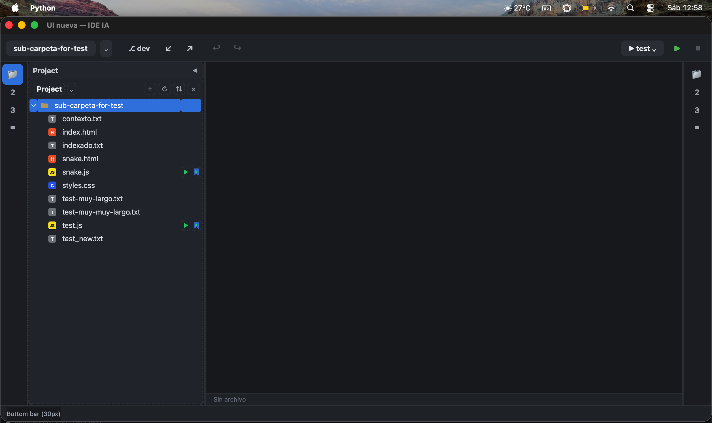

# IDE-IA

Un IDE local con IA construido en Python y Qt que se conecta a proveedores de IA locales (LM Studio, OpenCode Go) y permite a la IA operar directamente sobre los archivos del workspace.




## Características

- **Proveedores de IA locales**: LM Studio, OpenCode Go y cualquier API compatible con OpenAI
- **Herramientas de archivos**: la IA puede listar, leer, crear y editar archivos del workspace
- **Workspace sandboxing**: cada carpeta tiene su propio contexto, conversación y presupuesto de tokens
- **Streaming de respuestas**: las respuestas de la IA aparecen en tiempo real
- **Multimodal**: soporte para imágenes (PNG, JPG, GIF, WEBP, BMP) con modelos de visión
- **Voz a texto**: grabación con micrófono y transcripción automática
- **Terminal integrada**: ejecuta archivos `.py`, `.js`, `.java` con un clic
- **Visor de imágenes**: doble clic en SVG/PNG/JPG abre un visor con zoom
- **Editor con diff**: visualiza los cambios que hace la IA en los archivos
- **Preferencias**: modelo primario, secundario, de visión, presupuesto de tokens por carpeta
- **Compresión de contexto**: resume conversaciones automáticamente para ahorrar tokens
- **Gestión de turnos**: excluye turnos del contexto para reducir el consumo de tokens
- **`contexto.txt`**: archivo de contexto persistente por proyecto
- **`indexado.txt`**: mapa del proyecto generado por la IA
- **Sonidos**: feedback de audio al grabar, enviar y recibir respuestas
- **Servicios en segundo plano**: el trabajo pesado (watchers de git/archivos, poll de RAM) corre en `QThread`s propios — si un servicio se cuelga, la UI no se congela
- **Monitor de tareas**: panel "Servicios" con estado, heartbeat y botones start/stop/restart por servicio (botón ▦ en la hotbar)
- **Log interno**: overlay flotante con el log de la app — eventos de servicios, boot queue y excepciones (botón ≣ en la hotbar)
- **Boot queue progresiva**: los servicios arrancan escalonados tras mostrar la ventana; el progreso se ve en el monitor

## Arquitectura de servicios

Cada servicio sigue el patrón **Service/Worker**: el `Service` vive en el hilo UI y controla el ciclo de vida; el `Worker` es un `QObject` que vive en el `QThread` y hace el trabajo real.

```
UI thread                          QThread "file-watch"
───────────                        ────────────────────
FileWatchService ──señal──▶        FileWatchWorker
  · start/stop/restart               · QFileSystemWatcher
  · heartbeat/watchdog               · debounce 300ms
  · estado p/ MonitorPanel           · daemon threads (walk/diffs)
  · subscribe_*()        ◀──señal──    · changed/diffs_ready/busy
```

- **El Service nunca se mueve de thread** — la UI habla siempre con él y él traduce a señales hacia el worker.
- **El Worker no sabe que es un servicio** — es un `QObject` común, testeable sin `ServiceManager`.
- Si el worker se cuelga, el Service lo detecta (watchdog) y lo reporta — el worker no puede reportarse a sí mismo.

Servicios actuales (`UTILS/CORE-SERVICES/`): `git-watch` (listener de git), `sys-info` (RAM del IDE), `file-watch` (watcher + análisis de archivos del workspace).

## Instalación

```bash
pip install PySide6 requests SpeechRecognition
```

Requiere `ffmpeg` para grabación de voz:

```bash
# macOS
brew install ffmpeg
```

## Uso

```bash
python ng-studio-app.py
```

Con splash de inicio (pantalla + sonido):

```bash
python ng-studio-app.py --splash
```

O doble clic en `run.command` (macOS).

## Estructura

```
cli-ia/
├── chat_ia.py          # Aplicación principal
├── run.command         # Launcher para macOS
├── requirements.txt    # Dependencias
├── iconos/             # Iconos SVG
├── Voice/              # Grabaciones de voz
├── Skills-py/          # Skills personalizadas
├── conversaciones/     # Conversaciones guardadas (auto)
└── README/
    └── README.png      # Captura de pantalla
```

## Configuración

1. Abrir Preferencias (⚙ arriba a la derecha)
2. Configurar providers (LM Studio, OpenCode Go, etc.)
3. Elegir modelo primario, secundario y de visión
4. Setear presupuesto de tokens por carpeta
5. Activar auto-resumir si se quiere compresión automática

## Licencia

Uso personal.
